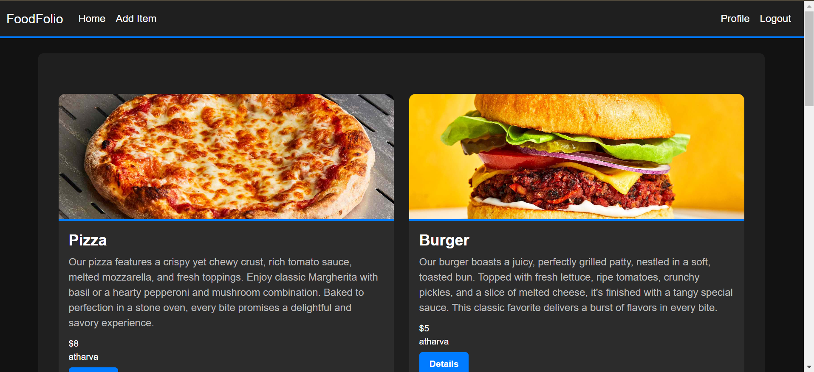
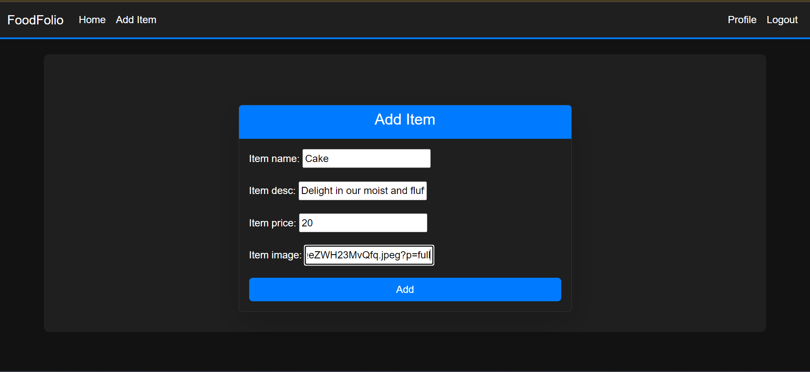
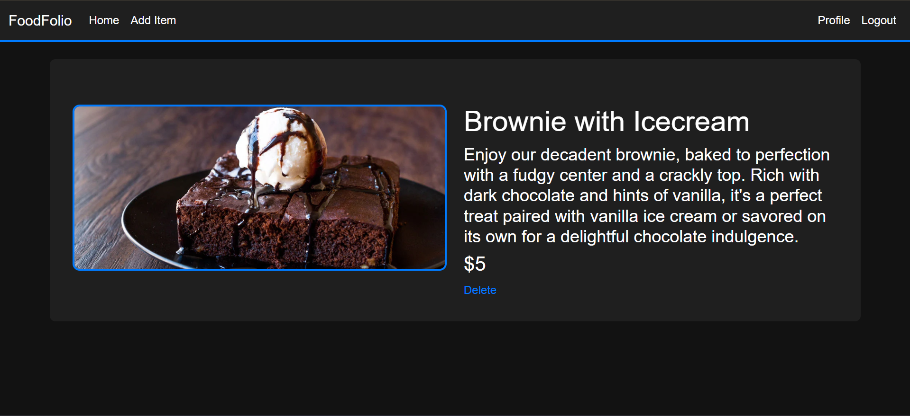

# FoodFolio 🍴

FoodFolio is a Django-based web application designed to help restaurants and chefs manage their menu items effortlessly. With FoodFolio, users can add, update, and delete food items along with their descriptions, prices, and images, ensuring a visually appealing and user-friendly experience.

## Features 🚀

- **Easy Food Management:** Add, update, and delete food items effortlessly.
- **Responsive Design:** Ensures seamless usability across devices.
- **User-friendly Interface:** Simplifies menu management for restaurant owners.

## Demo 📹

Check out the demo video of FoodFolio: [https://www.loom.com/share/f0c00ef2a360443fb23b1110750fc24f?sid=3610c1f4-b793-47e5-a8b2-50efc0ac8e0e]

## Screenshots 📸

### Home Page


### Add Item Page


### Item Details Page


## Technologies Used 🛠️

- **Frontend:** HTML, CSS, Bootstrap
- **Backend:** Django, Python
- **Database:** SQLite (default with Django)

## Setup and Installation 🛠️

1. **Clone the repository:**
    ```sh
    git clone https://github.com/AtharvaDeokar21/Food-Menu.git
    cd mysite
    ```

2. **Create a virtual environment:**
    ```sh
    python -m venv venv
    source venv/bin/activate  # On Windows use `venv\Scripts\activate`
    ```

3. **Install dependencies:**
    ```sh
    pip install -r requirements.txt
    ```

4. **Run migrations:**
    ```sh
    python manage.py migrate
    ```

5. **Create a superuser:**
    ```sh
    python manage.py createsuperuser
    ```

6. **Run the development server:**
    ```sh
    python manage.py runserver
    ```

7. **Access the application:**
    Open your browser and navigate to `http://127.0.0.1:8000/food`

## Usage

- **Home Page:** View a list of all food items.
- **Add Item:** Add new food items to the menu.
- **Item Details:** View detailed information about a specific food item.
- **User Authentication:** Register and login to manage your food items.

## Contributing 🤝

Contributions are welcome! Please fork the repository and create a pull request with your changes.

## License 📄

This project is licensed under the MIT License - see the [LICENSE](/LICENSE) file for details.

## Contact 📬

Feel free to reach out with any questions or suggestions:
- **Name:** Atharva Deokar
- **LinkedIn:** [www.linkedin.com/in/atharva-deokar-70643628b]
- **Email:** atharva.deokar2005@gmail.com

---

Thank you for checking out FoodFolio! Happy cooking! 👨‍🍳👩‍🍳
